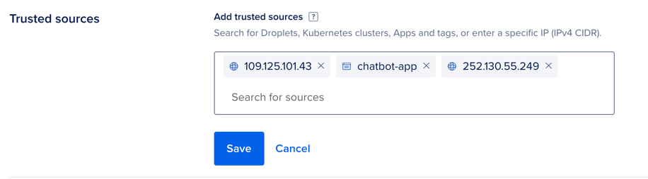
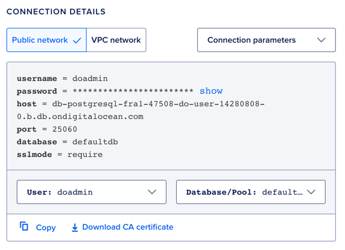

# Setup Guide

## 1. Prerequisites
**Mandatory**
- Python 3.10
- requirements.txt `pip install -r requirements.txt`
- .env with secrets
**Optional:**
- Docker

It is recommended to use a virtual environment for the project.

--- 

## 2. Running the chatbot locally

Each chatbot module (Decision-Making Module, Lead Generation Module, Knowledge Retrieval Module) can be run independently from the terminal.

- Activate the virtual environment via `source venv/bin/activate`
- Run the chatbot
  - Option 1: Run via Python `python app/chatbot/chatbot.py`
  - Option 2: Run via Docker `docker build -t chatbot . && docker run -it chatbot`
  - Option 3: Run via IDE (PyCharm, VSCode, etc.)

---
## 3. Deployment

- The chatbot is currently deployed on Digital Ocean. The deployment is done via Docker.
- The GitHub repository is connected to Digital Ocean. Any changes to the main branch will trigger a new deployment.
---
## Database Access

For security reasons, the PostgreSQL database is not accessible from localhost by default. 
To access the database from your local machine, you need create a trusted source in the Digital Ocean database settings.

1. Look up your IP adress with `curl ifconfig.me` or https://whatismyipaddress.com 
2. Add the IP address to the trusted sources in the [Digital Ocean Database Settings ](https://cloud.digitalocean.com/databases/710c05a7-bab4-4cd3-be29-155bbf79a5a2/settings?i=9d8192)

3. Connect to the DB with your desired IDE and the provided credentials from Digital Ocean

4. 
