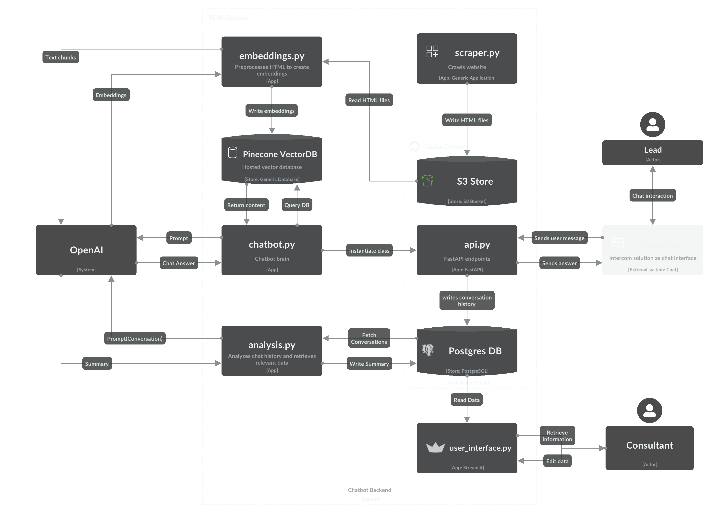

# TCW Chatbot

TCW Chatbot is a solution developed for the master's thesis *"Advances in Consulting Service Delivery: Developing a Large Language Model-Based Chatbot for Automated Proposal Generation"*. This chatbot leverages large language models (LLMs) to generate proposals automatically based on chat history.

## How It Works
A user interacts with a chat widget on a consulting firm's website, discusses their needs and pain points. The chatbot collects, analyzes these interactions, and generates a structured proposal.

## Technologies
The project, developed in Python, uses:

- OpenAI's GPT Model & Embeddings Model
- S3 Storage
- PostgreSQL Database
- Pinecone Vector DB
- Hosted on DigitalOcean



## Repository Structure
```markdown
.
├── Dockerfile
├── README.md
├── requirements.txt
├── app
│   ├── main.py
│   ├── config.py
│   ├── analysis
│   │   └── analysis.py
│   ├── api
│   │   ├── __init__.py
│   │   └── api.py
│   ├── chatbot
│   │   ├── __init__.py
│   │   ├── chatbot.py
│   │   ├── lead_chatbot.py
│   │   └── retrieval_chatbot.py
│   ├── core
│   │   └── logger.py
│   ├── database
│   │   ├── __init__.py
│   │   ├── manager.py
│   │   └── models.py
│   └── scripts
│       ├── embeddings.py
│       └── scraper.py
└── static
    ├── application.png
    └── index.html
```


