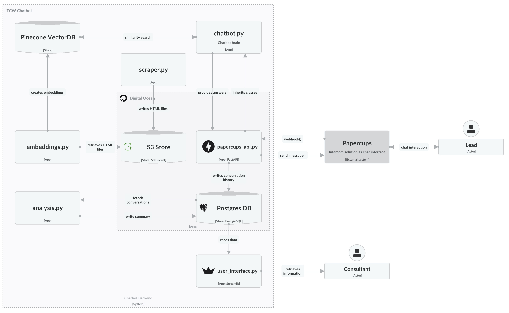

# TCW Chatbot

TCW Chatbot is a solution developed for the master's thesis *"Advances in Consulting Service Delivery: Developing a Large Language Model-Based Chatbot for Automated Proposal Generation"*. This chatbot leverages large language models (LLMs) to generate proposals automatically based on chat history.
## Target Users
Our main users are consultants and individuals interested in AI-driven proposal generation.

## How It Works
A user interacts with a chat widget on a consulting firm's website, discusses their needs and pain points. The chatbot collects, analyzes these interactions, and generates a structured proposal.

## Technologies
The project, primarily developed in Python, uses:

- OpenAI's GPT
- Embeddings
- PostgreSQL Database
- S3 Storage
- Pinecone Vector DB

